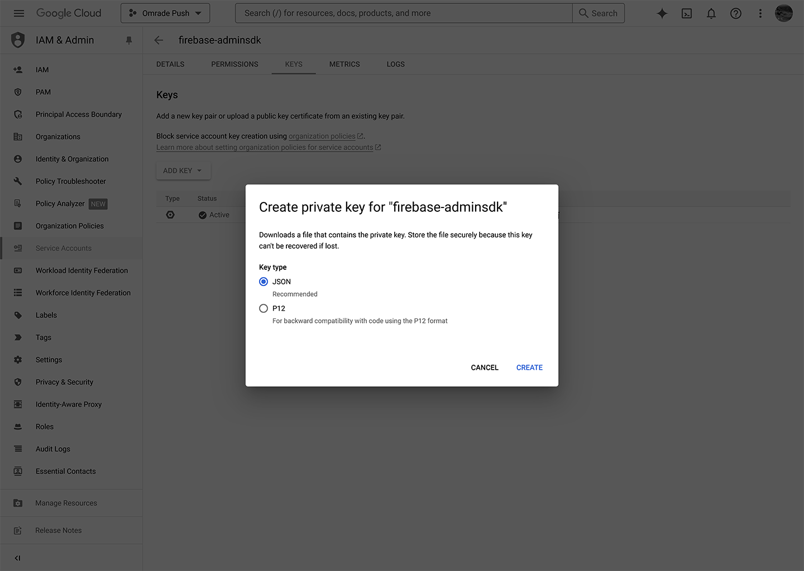

# Installation

**1.** Create a [Google Firebase](https://console.firebase.google.com/) account and start a new project.


**2.** Navigate to **Project Overview > Project Settings**.


**3.1.** Under the **General** tab, select the option to create a **Web App**.


**3.2.** Name your app and click **Register App**.


**3.3.** Copy the highlighted information from your **App’s Firebase Configuration** and paste it into the **Modules Configuration** as follows: `apiKey` = `Web API Key`, `messagingSenderId` = `Sender ID`, and `appId` = `Web App ID`.


**4.1.** In the **Cloud Messaging** tab, select "**Generate Key Pair**".


**4.2.** Copy the highlighted information from your **Web Push Certificates** and paste it into the **Modules Configuration** as follows: `Key pair` = `Key Pair from the Web Push certificates`


**5.1.** In the **Cloud Messaging** tab, under **Firebase Cloud Messaging API**, click on "**Manage Service Accounts**".


**5.2.** Under **Service Accounts**, select your account.\
_**Note:** In some instances, it may take longer for Google to generate the account automatically. In rare cases where the account is not generated, please create one by clicking on "Create Service Account"._


**5.3.** Switch to the **Keys** tab and click **Create New Key**.


**5.4.** Choose **JSON** as the Key type and click **Create**.



**6.** Open your Service Account key JSON file, and copy its contents into the `Service Account (JSON file)` field in the **Modules Configuration**.


**7.** When you are finished, click **Save** on the **Modules Configuration** page.


----

## Custom CSP Configuration 

If you have customized your [CSP header](https://docs.humhub.org/docs/admin/security#web-security-configuration), make sure to allow the following URLs:

```PHP
"script-src" => [
    "self" => true,
    "allow" => [
        "https://www.gstatic.com/firebasejs/10.6.0-20231107192534/firebase-app.js",
        "https://www.gstatic.com/firebasejs/10.6.0-20231107192534/firebase-messaging.js"
    ]
],
 "connect-src" => [
    "self" => true,
    "allow" => [
        "https://fcm.googleapis.com/"
    ]
],
``` 
